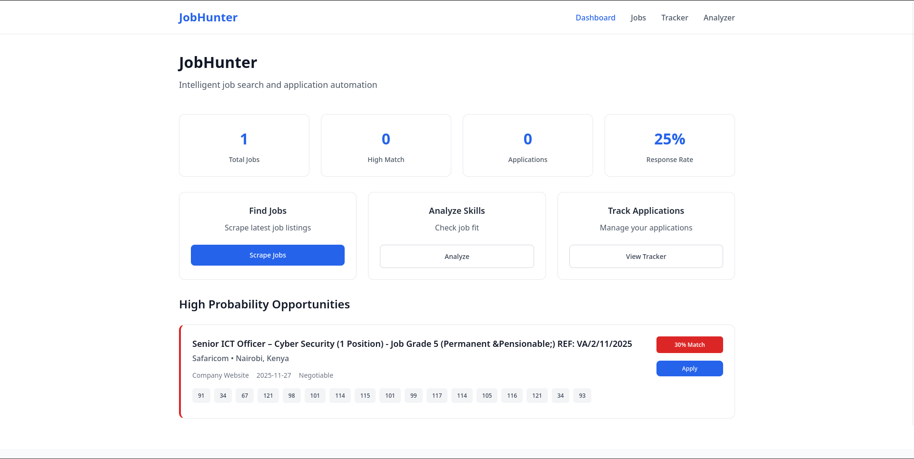

# jobhunter-tool
A web scraper that pulls job listings from multiple sources based on your predefined keywords.

# JobHunter AI - Targeted Job Application Engine


---

## 🎯 Overview

JobHunter is an intelligent job search and application automation tool designed specifically for cybersecurity professionals. It automates the research and targeting phase to ensure you only spend time on high-probability, high-fit opportunities.

**The Problem It Solves:**  
Manually searching for jobs on multiple platforms (LinkedIn, BrighterMonday, company sites) is inefficient. Generic applications get low response rates. This tool automates the research and targeting phase to ensure you focus only on high-probability, high-fit opportunities.

---

## 🚀 Features

### Core Features
- 🤖 **Intelligent Job Aggregator** - Real-time scraping from multiple job sources  
- 📊 **Company & Role Scorer** - Automatic job fit scoring (1-100) based on your skills  
- 👥 **Hiring Manager Finder** - Identifies key contacts for high-scoring jobs  
- ✍️ **AI Cover Letter Generator** - Personalized application drafts using AI  
- 📈 **Application Tracker** - Complete CRM for tracking your job applications  

### Advanced Features
- 🔍 **Skills Gap Analyzer** - Identifies exactly what skills you're missing for specific roles  
- 🏢 **Company Deep Dive** - Generates company briefings before interviews  
- 📱 **Real-time Dashboard** - Live statistics and high-probability opportunities  

---

## 🛠️ Tech Stack

### Backend
- Go 1.21+  
- Fiber (Fast web framework)  
- GORM with SQLite  
- Colly (Web scraping framework)  

### Frontend
- HTML5, CSS3, Vanilla JavaScript  
- Responsive design (mobile-first approach)  

### AI & Processing
- OpenAI Integration for cover letters and analysis  
- Custom scoring algorithm for skill-based job matching  
- Background processing for automated scraping and analysis  

---

## 📦 Installation

### Prerequisites
- Go 1.21+  
- SQLite3  
- (Optional) OpenAI API key for AI features  

### Quick Start
```bash
# Clone the repository
git clone https://github.com/yourusername/jobhunter-tool.git
cd jobhunter-tool

# Install dependencies
go mod download
go mod tidy

# Set up environment variables
cp .env.example .env
# Edit .env with your configuration

# Run the application
go run main.go

Access the application:
Open http://localhost:3000 in your browser.

Environment Configuration

Create a .env file in the root directory:

# Server Configuration
PORT=3000
ENVIRONMENT=development

# OpenAI API (Optional - for AI features)
OPENAI_API_KEY=your_openai_api_key_here

# Database
DATABASE_PATH=./jobhunter.db

# Scraping Configuration
SCRAPING_DELAY=4
SCRAPING_TIMEOUT=30


🏗️ Project Structure

jobhunter-tool/
├── main.go                 # Application entry point
├── go.mod                  # Go dependencies
├── .env                    # Environment variables
│
├── database/
│   └── database.go         # Database models and operations
│
├── models/
│   └── gorm_models.go      # GORM model definitions
│
├── handlers/
│   └── real_handlers.go    # HTTP request handlers
│
├── scraper/
│   └── real_scraper.go     # Job scraping engine
│
├── ai/
│   └── generator.go        # AI integration for cover letters
│
├── templates/              # HTML templates
│   ├── layout.html
│   ├── index.html
│   ├── jobs.html
│   ├── tracker.html
│   ├── analyzer.html
│   ├── company.html
│   └── job-detail.html
│
└── static/                 # Static assets
    ├── css/
    │   └── custom.css
    └── js/
        └── main.js


Usage Guide
Dashboard (/)



Real-time Statistics: Total jobs, high matches, applications, response rate

Quick Actions: One-click scraping, analysis, tracking

High-Probability Opportunities: Top-scoring jobs based on your skills


Job Board (/jobs)

Smart Filtering: Filter by score, skills, company, location

Quick Actions: Apply, analyze, view original postings

Real-time Scoring with color coding


Application Tracker (/tracker)

Status Tracking: Applied, Interviewing, Offer, Rejected

CRM Features: Add notes, hiring manager contacts, follow-up dates


Skills Analyzer (/analyzer)

Skills Gap Analysis

AI Recommendations

Transferable Skills highlighting


Company Pages (/company/:name)

Company-focused view for all opportunities

Consistent scoring


Quick comparison within the same company

 API Endpoints

Job Management

Method  	Endpoint	    Description
GET	     /api/jobs	        Get jobs with pagination
GET	    /api/stats	        Get system statistics
GET	    /jobs/scrape	    Start job scraping
POST	/jobs/:id/apply	    Track job application


Skills & Analysis
Method	Endpoint	     Description
POST	/analyze-skills	 Analyze job description fit
POST	/cover-letter	 Generate AI cover letter
POST	/skills/add	     Add user skill


Application Tracking

Method	Endpoint	            Description
POST	/tracker/add	        Add manual application
PUT	    /tracker/:id/status	    Update application status
DELETE	/tracker/:id	        Delete application


AI Integration
Cover Letter Generation

Uses OpenAI GPT models to generate personalized cover letters

Example request:

{
  "job_title": "SOC Analyst",
  "company": "Safaricom",
  "job_description": "Looking for SOC analyst with Fortinet experience...",
  "user_profile": "Cybersecurity professional with 3 years experience..."
}


Skills Analysis

Fit Score (1-100) based on skill matching

Missing Skills identification

Transferable Skills highlighting

Personalized Recommendations


🕷️ Web Scraping
Supported Sources

BrighterMonday Kenya

Fuzu Kenya

Company Career Pages: Safaricom, KCB Bank, Equity Bank

Scraping Features

Respectful crawling with delays and rate limiting

Robust error handling

Duplicate prevention via URL deduplication

Background processing


Data Models

Job 

type Job struct {
    ID          string    `gorm:"primaryKey"`
    Title       string    `gorm:"not null"`
    Company     string    `gorm:"not null"`
    Location    string    
    Description string    
    SalaryRange string    
    Experience  string    
    PostedDate  string    
    Source      string    
    URL         string    `gorm:"unique"`
    Score       int       `gorm:"default:0"`
    Skills      []string  `gorm:"serializer:json"`
    TechStack   []string  `gorm:"serializer:json"`
    CreatedAt   time.Time `gorm:"autoCreateTime"`
}

Application

type Application struct {
    ID            string    `gorm:"primaryKey"`
    JobID         string    
    Company       string    
    Role          string    
    AppliedDate   string    
    Status        string    `gorm:"default:Applied"`
    HiringManager string    
    Notes         string    
    CreatedAt     time.Time `gorm:"autoCreateTime"`
}


Scoring Algorithm

Skill Matching (60 points)

Experience Level (20 points)

Salary Indication (10 points)

Company Reputation (10 points)

Deployment

Docker Deployment
		docker build -t jobhunter-tool .
		docker run -p 3000:3000 -v $(pwd)/data:/app/data jobhunter-tool

Manual Deployment

		go build -o jobhunter-tool main.go
		./jobhunter-tool
		
				
Production Considerations:

Set ENVIRONMENT=production in .env

Use nginx for SSL termination

Configure database backups

Enable logging and monitoring


🔒 Security Features

Input validation

SQL injection protection (GORM queries)

XSS prevention (template auto-escaping)

Rate limiting in scraping engine

Proper CORS configuration


🐛 Troubleshooting

Scraping issues: Check internet, delays, site accessibility

Database issues: Permissions, path, SQLite3 installed

AI issues: OpenAI API key, quota, logs

Logs:

tail -f jobhunter.log


Contributing

Fork the repository

Create a feature branch

Make changes & add tests

Submit a pull request


Code Style:

Follow Go standard formatting

Descriptive variable names

Include comments for complex logic


📄 License

MIT License - see the LICENSE file for details.


🙏 Acknowledgments

Fiber - Fast Go framework

GORM - ORM library

Colly - Web scraping

OpenAI - AI capabilities

TailwindCSS - CSS framework


📞 Support

Documentation: GitHub Wiki

Issues: GitHub Issues

Discussions: GitHub Discussions

Email: support@jobhunter-ai.com


🚀 Future Roadmap
Short Term

Additional job sources

Enhanced AI analysis

Mobile application

Browser extension


Long Term

Multi-user support

Advanced analytics

Integration with job platforms

Career growth tracking

JobHunter - Making your job search smarter, faster, and more effective. 🎯

Built with ❤️ for cybersecurity professionals
